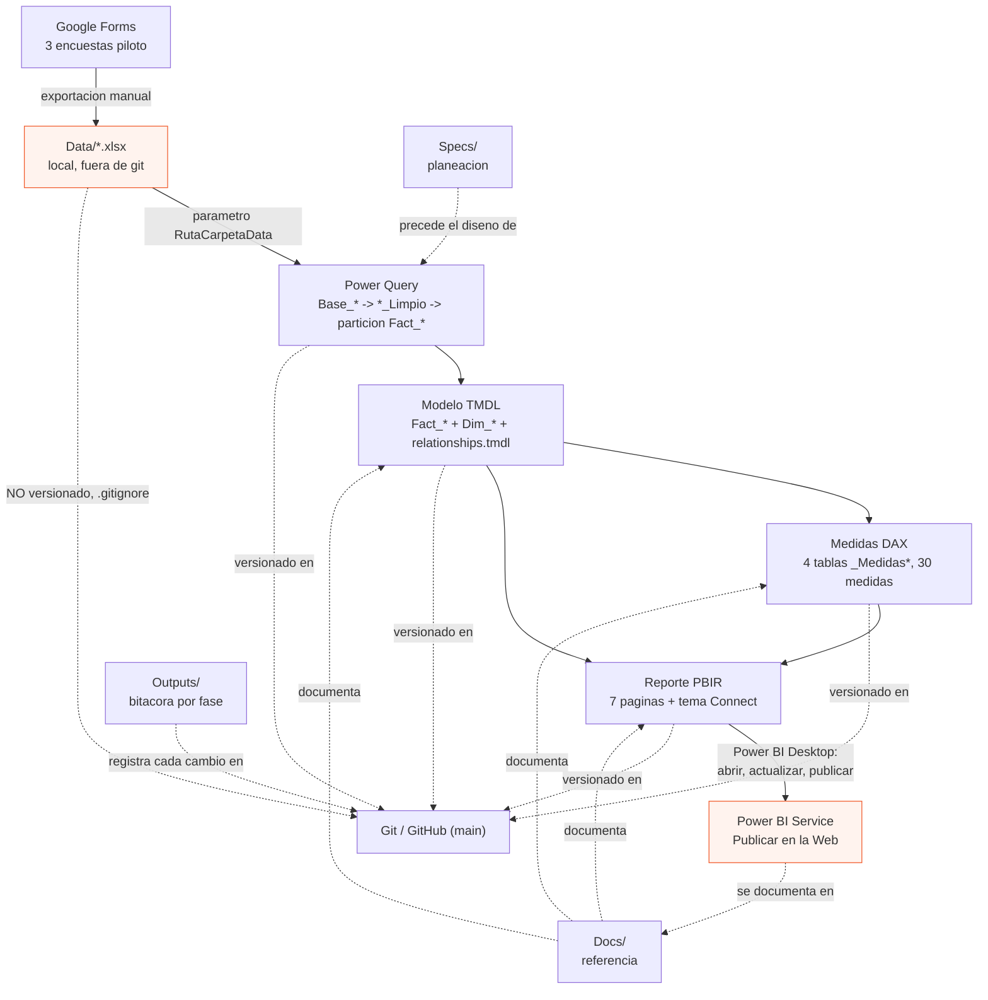

# Arquitectura del sistema — Big Picture `PBI_Indicadores`

Vista integrada de cómo se conectan las fuentes de datos, Power Query, el modelo semántico TMDL, las medidas DAX, el reporte PBIR, la documentación, Git/GitHub y Power BI Service. Este documento no repite el detalle ya cubierto por [Docs/01](01_modelo_datos.md)–[06](06_publicacion_powerbi.md); enlaza a cada uno como fuente de verdad de su capa y se enfoca en cómo encajan entre sí.

Si es la primera vez que trabaja en este proyecto, lea primero [README.md](../README.md) y [Docs/00_indice_documentacion.md](00_indice_documentacion.md); vuelva aquí cuando necesite razonar sobre el sistema completo (por ejemplo, antes de evaluar el impacto de una fuente nueva como la analizada en [Specs/04](../Specs/04_analisis_impacto_informe_altas_t_resuelve.md)).

## 1. Diagrama general

Las cajas naranjas marcan los dos puntos de mayor riesgo operativo: `Data/` (fuente local no versionada, punto único de fallo) y la publicación pública en Power BI Service (sin autenticación, ver §5).

## 2. Flujo end-to-end

1. **Captura**: las 3 encuestas viven en Google Forms (calidad de llamadas, satisfacción de capacitación, motivación de actividades comerciales). No hay conexión automática — el flujo depende de exportación manual.
2. **Exportación manual → `Data/`**: cada encuesta se exporta a un `.xlsx` (hoja `Form Responses 1`) y se coloca en `Data/`, carpeta excluida de git (`.gitignore`) porque contiene nombres reales de personas. Guía operativa completa en [Docs/04](04_fuentes_y_actualizacion_datos.md). Los archivos deben estar **cerrados** en Excel antes de actualizar en Power BI Desktop.
3. **Ingesta y limpieza (Power Query)**: `expressions.tmdl` referencia `Data/` mediante el parámetro `RutaCarpetaData` (sin rutas absolutas embebidas). Cada fuente sigue la misma cadena de 3 etapas: `Base_<Fuente>` (staging crudo, carga deshabilitada) → `<Fuente>_Limpio` (Trim/Clean, tipos, `Fecha` desde `Timestamp`, `CallCenter` en mayúsculas) → partición de la tabla `Fact_<Fuente>` (nombres técnicos finales, reglas de negocio como `"N/A"` → `null`). Ver la convención completa en `CLAUDE.md` §"Convenciones de trabajo".
4. **Modelo semántico (TMDL)**: las 3 tablas `Fact_*` cargan al modelo en estrella. `Dim_Calendario`, `Dim_CallCenter` y `Dim_Jornada` se construyen dinámicamente en Power Query (uniones de valores distintos observados, nunca listas fijas) y se relacionan con las `Fact_*` en `relationships.tmdl` (8 relaciones de negocio `1:*`, más 3 auxiliares de Auto Date/Time — ruido conocido). Detalle completo en [Docs/01](01_modelo_datos.md).
5. **Medidas DAX**: 4 tablas de medidas (`_Medidas Generales/Calidad/Capacitacion/Motivacion`, 30 medidas) se calculan sobre el modelo TMDL — nunca sobre `Data/` directamente. Catálogo completo con fórmula exacta en [Docs/02](02_catalogo_medidas_dax.md).
6. **Reporte (PBIR)**: 7 páginas (`PBI_Indicadores.Report/definition/pages/`) consumen las medidas DAX y las dimensiones para segmentadores, tarjetas y gráficos, con navegación `PageNavigation` entre Home y páginas internas, y el tema visual `Assets/theme/connect_assistance_theme.json`. Mapa completo en [Docs/03](03_mapa_reporte_paginas_visuales.md).
7. **Validación en Power BI Desktop**: no hay build ni pruebas automáticas — cada cambio se valida abriendo el `.pbip` en Power BI Desktop. Desktop reescribe archivos automáticamente al abrir/guardar (`lineageTag`, `summarizeBy`, tablas ocultas de Auto Date/Time, `PBI_QueryOrder`); esos cambios se revisan con `git status`/`git diff` y se comitean por separado de los cambios intencionales.
8. **Publicación (Power BI Service)**: desde Power BI Desktop, "Publicar en la Web" genera el enlace público usado hoy (ver [Docs/06](06_publicacion_powerbi.md)). Es un mecanismo sin autenticación — cualquier persona con el enlace ve el informe, incluyendo 2 tablas con nombres reales de asesores/formadores.
9. **Versionado (Git/GitHub)**: cada capa de código (Power Query, TMDL, PBIR) y cada documento (`Specs/`, `Docs/`, `Outputs/`, `README.md`) se versiona en Git con commits `tipo(ámbito): asunto en español`, en `github.com/HarvLopez91/pbi-indicadores-connect` (rama `main`, sin push a remoto hasta que el usuario lo confirme explícitamente). `Data/*.xlsx` nunca se comitea — su único respaldo es la sincronización de OneDrive.
10. **Documentación**: `Specs/` precede el diseño (por qué se construyó así), `Docs/` describe el estado actual de cada capa (referencia viva), `Outputs/` registra cada fase/corrección ejecutada en orden cronológico (bitácora, no se sobrescribe). Este documento es la capa que conecta las tres.

## 3. Tabla de capas

| # | Capa | Qué es | Dónde vive | Se documenta en |
|---|---|---|---|---|
| 1 | Fuentes | 3 encuestas de Google Forms | Fuera del repositorio (Google) | [Docs/04](04_fuentes_y_actualizacion_datos.md) |
| 2 | Datos crudos | Exportaciones `.xlsx` | `Data/` (no versionada) | [Docs/04](04_fuentes_y_actualizacion_datos.md) |
| 3 | Power Query | Ingesta + limpieza + reglas de negocio | `PBI_Indicadores.SemanticModel/definition/expressions.tmdl` y bloque `partition ... = m` de cada `tables/*.tmdl` | `CLAUDE.md`, [Docs/01](01_modelo_datos.md) |
| 4 | Modelo TMDL | Tablas de hechos/dimensión, relaciones | `PBI_Indicadores.SemanticModel/definition/{model,relationships}.tmdl`, `tables/*.tmdl` | [Docs/01](01_modelo_datos.md) |
| 5 | Medidas DAX | 30 medidas en 4 tablas `_Medidas *` | `tables/_Medidas *.tmdl` | [Docs/02](02_catalogo_medidas_dax.md) |
| 6 | Reporte PBIR | Páginas, visuales, navegación, tema | `PBI_Indicadores.Report/definition/` (`pages/`, `report.json`, `StaticResources/`) | [Docs/03](03_mapa_reporte_paginas_visuales.md) |
| 7 | Recursos de marca / referencia | Logos, imágenes, tema JSON, mockups de referencia (no cargados al PBIR) | `Assets/{logos,imagenes,theme,mockups}/` | Este documento, `Outputs/17` |
| 8 | Documentación | Planeación, referencia técnica, bitácora | `Specs/`, `Docs/`, `Outputs/`, `README.md`, `CLAUDE.md`, `AGENTS.md` | [Docs/00](00_indice_documentacion.md) |
| 9 | Git / GitHub | Versionado, historial, convención de commits | Repositorio completo, rama `main` | `AGENTS.md` §"Commits y Pull Requests" |
| 10 | Power BI Service | Publicación pública ("Publicar en la Web") | Fuera del repositorio (tenant de Power BI) | [Docs/06](06_publicacion_powerbi.md) |

## 4. Dependencias entre capas

- **`Data/` → Power Query**: un cambio de encabezado/columna en el Excel de origen rompe la etapa `Base_*`/`*_Limpio` correspondiente antes de llegar al modelo. No hay validación automática — el primer indicio suele ser un error de Power BI Desktop al actualizar.
- **Power Query → Modelo TMDL**: renombrar una columna en la partición `Fact_*` sin actualizar las medidas DAX que la referencian produce error de referencia rota, visible solo al abrir en Desktop.
- **`Dim_CallCenter`/`Dim_Jornada` → Fact_\***: al ser uniones dinámicas de valores observados, un valor nuevo o mal escrito en el origen (p. ej. `"CALL CENTER A "` con espacio) crea una fila de dimensión adicional en vez de coincidir con la existente — no hay catálogo maestro que lo evite (dependencia D4, pendiente).
- **Medidas DAX → Reporte PBIR**: cada visual referencia medidas por nombre exacto; renombrar una medida sin actualizar el catálogo ([Docs/02](02_catalogo_medidas_dax.md)) rompe visuales sin error visible en TMDL (el error aparece solo en el reporte).
- **Modelo/Reporte → Documentación**: `Docs/01`–`03` describen el estado en el momento en que se escribieron; si el modelo o el reporte cambian sin actualizar `Docs/`, la documentación queda desalineada silenciosamente (no hay verificación automática).
- **Todo → Power BI Service**: la publicación es una foto del PBIP en el momento de publicar. Un cambio posterior en el repositorio no se refleja en el enlace público hasta que alguien vuelve a publicar manualmente desde Desktop.

## 5. Riesgos de arquitectura

- **Publicación pública sin autenticación**: el enlace de "Publicar en la Web" expone 2 tablas con nombres reales de personas a cualquiera que reciba el enlace, sin control de acceso ni auditoría (ver [Docs/06](06_publicacion_powerbi.md) §2). Este riesgo crece si se integran fuentes con más datos personales, como la analizada en [Specs/04](../Specs/04_analisis_impacto_informe_altas_t_resuelve.md) (nombres de jefe/especialista/asesor).
- **`Data/` es un punto único de fallo no versionado**: su único respaldo es la sincronización de OneDrive, no Git. Si `Data/` se pierde o corrompe localmente y OneDrive no alcanzó a sincronizar, no hay forma de reconstruirla desde el repositorio.
- **Ausencia de catálogo maestro** (call center, jornada, alias de líder/asesor): las dimensiones dinámicas evitan mantenimiento manual, pero también permiten que inconsistencias de captura en el origen se propaguen como filas de dimensión nuevas en vez de fallar de forma visible (dependencias D4/D5, ver [Docs/05](05_decisiones_limitaciones_pendientes.md)).
- **Ruido de Auto Date/Time**: tablas ocultas `DateTableTemplate_*`/`LocalDateTable_*` y relaciones auxiliares persisten en el modelo; limpiarlas requiere una intervención manual en Power BI Desktop con riesgo de referencia huérfana en el `variation` de cada `Fecha` (ver [Docs/01](01_modelo_datos.md) §6).
- **Documentación desalineada por crecimiento no coordinado**: si una futura fuente (p. ej. Altas T Resuelve) se integra sin seguir el mismo patrón de fases + `Outputs/` + actualización de `Docs/`, el Big Picture descrito aquí deja de ser confiable.
- **Sin build ni prueba automática**: toda validación depende de abrir Power BI Desktop manualmente; un error de sintaxis TMDL o una referencia de columna rota solo se detecta en ese momento, nunca antes de comitear.

## 6. Recomendaciones para futuras versiones

1. **Tratar cualquier fuente nueva (p. ej. `v1.1` de Altas T Resuelve, [Specs/04](../Specs/04_analisis_impacto_informe_altas_t_resuelve.md)) como una extensión de este Big Picture, no como un pipeline paralelo ad-hoc**: mismo patrón `Base_*` → `*_Limpio` → `Fact_*`, mismas convenciones de nombres, y actualización de este documento (§1 diagrama y §3 tabla) en el mismo ciclo de fases.
2. **Resolver el gobierno de la publicación pública antes de crecer el modelo con más datos personales** — evaluar migrar de "Publicar en la Web" a un workspace de Power BI Service con control de acceso (ya señalado en [Docs/06](06_publicacion_powerbi.md) §2), especialmente si se agregan fuentes con nombres de jefe/especialista/asesor.
3. **Definir el catálogo maestro (D4/D5) antes de que una segunda fuente introduzca su propio concepto de "aliado"/call center** — evita tener que reconciliar dos taxonomías distintas después de integradas (`Dim_CallCenter` actual vs. `DESCRIPCION`/`DESCRIPCION2` de Altas T Resuelve).
4. **Mantener este documento como el punto de entrada para razonar sobre impacto de cambios** — antes de cualquier análisis de impacto nuevo, revisar §4 (dependencias) y §5 (riesgos) para no repetir diagnóstico ya conocido.
5. **No mezclar recursos de referencia/mockups con recursos activos del reporte**: `Assets/mockups/` (nuevo, ver `Outputs/36`) se reserva para imágenes de referencia/diseño que aún no están cargadas al PBIR, separado de `Assets/logos/`, `Assets/imagenes/` y `Assets/theme/`, que sí son consumidos activamente por el reporte.
6. **Actualizar este documento en cada fase que agregue una fuente, una capa o cambie el mecanismo de publicación** — igual que `Docs/01`–`06`, este documento puede desalinearse si no se mantiene junto con los cambios reales (ver §5 último punto).

## 7. Referencias

- [README.md](../README.md) — visión general y cómo abrir el proyecto.
- [Docs/00_indice_documentacion.md](00_indice_documentacion.md) — índice completo de documentación por rol.
- [Docs/01](01_modelo_datos.md)–[06](06_publicacion_powerbi.md) — detalle por capa.
- [Specs/02_plan_implementacion_informe_powerbi_connect.md](../Specs/02_plan_implementacion_informe_powerbi_connect.md) y [Specs/03_documentacion_final_informe_powerbi_connect.md](../Specs/03_documentacion_final_informe_powerbi_connect.md) — historia y cierre de la implementación inicial.
- [Specs/04_analisis_impacto_informe_altas_t_resuelve.md](../Specs/04_analisis_impacto_informe_altas_t_resuelve.md) — primer caso de extensión de esta arquitectura (`v1.1`, diagnóstico sin implementar).
- [Outputs/](../Outputs/) — bitácora cronológica completa.
